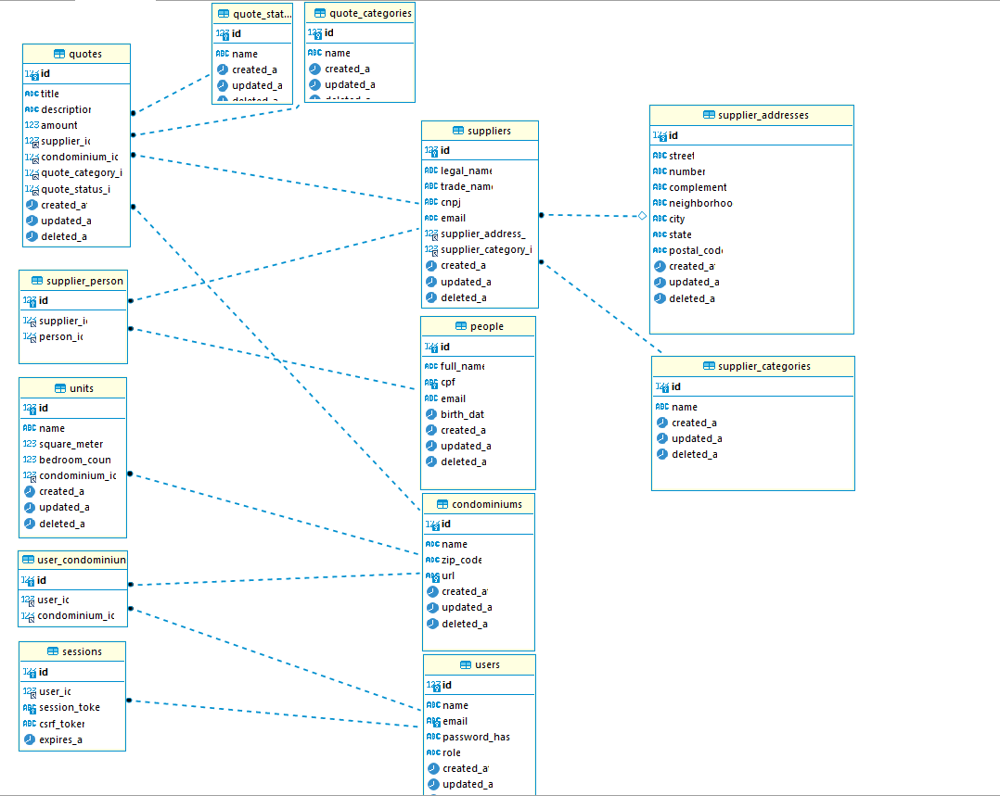

# Plano de Implementação

# 1. Definição de Perfis de Usuário

O primeiro passo da implementação é definir **perfis de usuário do sistema**.

Identifiquei dois perfis principais:

- **Pessoa da operação (usuário)**
- **Equipe interna GCondo (admin)**

# 2. Entendimento dos Escopos de Usuários

## 2.1 Pessoa da operação

- Pode cadastrar condomínios
- Pode visualizar seus próprios condomínios
- Pode editar os condomínios que cadastrou
- Pode registrar pessoas
- Pode visualizar todas as pessoas
- Não pode editar pessoas  
- Caso tente editar, o sistema exibirá um aviso informando que apenas administradores podem realizar essa ação
- Pode cadastrar fornecedores
- Pode visualizar todos os fornecedores
- Não pode editar fornecedores após cadastro
- Pode cadastrar orçamentos
- Pode visualizar seus próprios orçamentos
- Pode editar seus próprios orçamentos

## 2.2 Equipe interna GCondo (admin)

- Pode visualizar todas as pessoas
- Pode editar pessoas
- Pode cadastrar fornecedores
- Pode visualizar todos os fornecedores
- Pode editar fornecedores
- Pode cadastrar orçamentos
- Pode visualizar orçamentos
- Pode editar orçamentos

# 3. Desenho do Banco de Dados

# 4. Layout da Aplicação

A aplicação seguirá o padrão estabelecido previamente nos módulos de condomínios, aproveitando os componentes base.

# 5. Definir modelo de autenticação

Defini que o modelo de autenticação utilizado seria cookie-based. Para isso, o login guardará o ID da sessão dentro do navegador, e esse ID será usado para autenticar as rotas do sistema. A session, por sua vez, fica armazenada na tabela sessions do banco de dados.

OBSERVAÇÃO:
O grande desafio foi fazer o cookie chegar na API, já que a API roda em HTTP e o front em HTTPS. Nesse cenário o navegador não emite cookies nas requisições. Para solucionar isso tive que fazer um proxy pelo servidor do vite. O fluxo que era Navegador -> API virou Navegador -> container do frontend (servidor vite proxy em https) -> container nginx -> container backend. Isso deixou a aplicação lenta em DEV, mas permitou o desenvolvimento do teste.

# 5. Definir testes

Os testes serão desenvolvidos utilizando php unit e terão o intuito apenas de mostrar capacidade técnica de montar ambiente de testes e testar funcionalidades.

