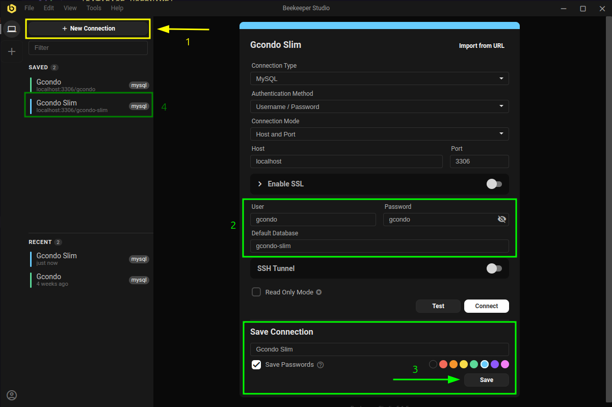

# Gcondo Slim ⚡️

Este projeto é dedicado à etapa técnica do processo seletivo para novos desenvolvedores.

> [!IMPORTANT]
> **Aviso para colaboradores Gcondo** \
> A *branch* `main` não deve ser enviada para os candidatos. \
> O repositório possui *branches* dedicadas para cada etapa do processo seletivo.

## Ambiente de desenvolvimento local

Por padrão, os candidatos recebem o projeto como um arquivo compactado.

> [!TIP]
> Você pode usar qualquer sistema operacional, seja ele **Windows** ou **Linux**.\
> Essa é a magia do **Docker** 🐳

### Requisitos

- Uma ferramenta para descompactar o arquivo compactado, como **WinRAR** ou **7-Zip**
- Uma **IDE**, como **Visual Studio Code**
- **Docker** e **Docker Compose**

### Sugestões

- Uma ferramenta para acessar e visualizar o banco de dados do projeto, como **Beekeeper**
  - 
- Extensões para o **Visual Studio Code**
  - [Docker](https://marketplace.visualstudio.com/items?itemName=ms-azuretools.vscode-docker)
  - [PHP Intelephense](https://marketplace.visualstudio.com/items?itemName=bmewburn.vscode-intelephense-client)
  - [Error Lens](https://marketplace.visualstudio.com/items?itemName=usernamehw.errorlens)
  - [Markdown All in One](https://marketplace.visualstudio.com/items?itemName=yzhang.markdown-all-in-one)

### Instalação

1. Descompactar o arquivo compactado em um local de sua escolha
2. Acessar o local escolhido no passo anterior
3. Inicializar os containers
    ```bash
    docker compose up -d
    ```
4. Acessar o container da **API**
    ```bash
    docker compose exec api bash
    ```   
5. Instalar as dependências com **Composer**
    ```bash
    composer install
    ```   
6. Configurar o banco de dados com **Phinx**
    ```bash
    composer run phinx:migrate
    ```

**A API estará disponível em http://localhost:8080 e o front-end em https://localhost:5100 ⚡️**


#### Como derrubar os containers?

```bash
docker compose stop
```

#### Como subir os containers novamente?

```bash
docker compose up -d
```

### Insomnia

> [!NOTE]
> Você pode usar outras ferramentas, como **Postman**, mas sugerimos **fortemente** que use o **Insomnia**, já que a coleção está pronta e configurada, facilitando muito o seu trabalho.

1. Abra o **Insomnia**
2. Clique em **"Create"** e escolha **"File"** -> **"Import"** -> **"From File"**
3. Selecione o arquivo `server/insomnia.json`.
  
Todas as rotas estarão disponíveis para teste 💫

## Contexto da etapa técnica

A proposta desta etapa é simular um cenário real de trabalho com autonomia de análise, documentação, implementação e validação.

Durante esta etapa, você deve:

1. Interpretar um **PRD** em linguagem de produto;
2. Documentar seu entendimento em um *design plan*;
3. Implementar a solução;
4. Opcionalmente validar os fluxos com testes automatizados;
5. Responder o formulário obrigatório ao final.

O PRD desta etapa está em [MINI_PRD.md](MINI_PRD.md).

## Processo da entrega

### Plano de design

O plano de design é um documento simples que pode ser feito por humanos ou por inteligência artificiais, como **Claude Code**. Ele é basicamente a ideia do que você deseja implementar em código, mas antes de iniciar a implementação. É muito importante e utilizado para revisão, evitando retrabalho e falhas no projeto.

Também conhecido como *spec*. Neste caso em específico, ele é construído a partir de um PRD, mas nem sempre é o caso.

Não tem resposta certa ou perfeita para este assunto, então fique tranquilo.

Você deve criar um arquivo em **Markdown** no repositório explicando, de forma objetiva:

1. O que você entendeu do PRD;
2. O que pretende construir;
3. Quais riscos e decisões considera importantes.

O nome e o caminho do arquivo são livres.

### Plano de implementação (Opcional)

O plano de implementação, diferente do plano de design, já é algo feito normalmente por inteligências artificiais, não sendo muito comum de ser feito por humanos. É mais comum que o plano de design já tenha partes do plano de implementação quando feito por humanos. 

Você pode criar um segundo arquivo em **Markdown** com o plano de implementação. O nome e o caminho do arquivo também são livres.


## Testes automatizados (opcional)

Os testes automatizados não são obrigatórios. A implementação do *PRD* e o preenchimento do formulário de encerramento são suficientes para a entrega.

A realização desta etapa será vista como um extra/bônus.

### Objetivo desta etapa

Garantir que os principais fluxos de produto estejam cobertos por testes e que o comportamento esperado esteja validado de forma reproduzível.

### Liberdade de ferramenta

Você pode escolher as ferramentas com as quais tem mais confiança, por exemplo: *Vitest*, *Jest*, *Cypress*, *Playwright*, *RTL*, *PHPUnit*, *Pest* ou testes de API com *Postman*/*Insomnia*.

### Cenários sugeridos

1. Adicionar teste para criação de um novo condomínio.
2. Adicionar teste para cadastro de pessoa.
3. Adicionar teste para cadastro de fornecedor.
4. Adicionar teste para criação de orçamento vinculado a fornecedor e condomínio.
5. Adicionar teste para um cenário de falha relevante (por exemplo, vínculo inválido ou dado obrigatório ausente).

## Formulário obrigatório de encerramento

O preenchimento do **Google Form** ao final da entrega é obrigatório.

> [!IMPORTANT]
> Submissões sem formulário preenchido serão desconsideradas.

Para acessar o formulário, clique [aqui](https://forms.gle/T74toUVYucQwTzdq9).

### Uso de agentes de IA

Caso você escolha usar agentes de IA, como **Cursor** e **Claude Code**, é importante que a conversa seja exportada e enviada no formulário de encerramento. Isso permite entender melhor como você trabalha com agentes e como escreve *prompts*.

## Tecnologias 🛠️

O repositório possui dois diretórios principais, sendo `server` para a **API REST** e `client` para uma **Single Page Application (SPA)**, que consome a **API REST**.

### Servidor 📚️

- PHP 8.4
- Slim 4.12
- Phinx 0.15
- Eloquent 12.0

### Cliente 💻️

- React 19
- Ant Design 5
- TypeScript 5
- Dayjs 1
- React Router 7
- Vite# gcondo_challenge
